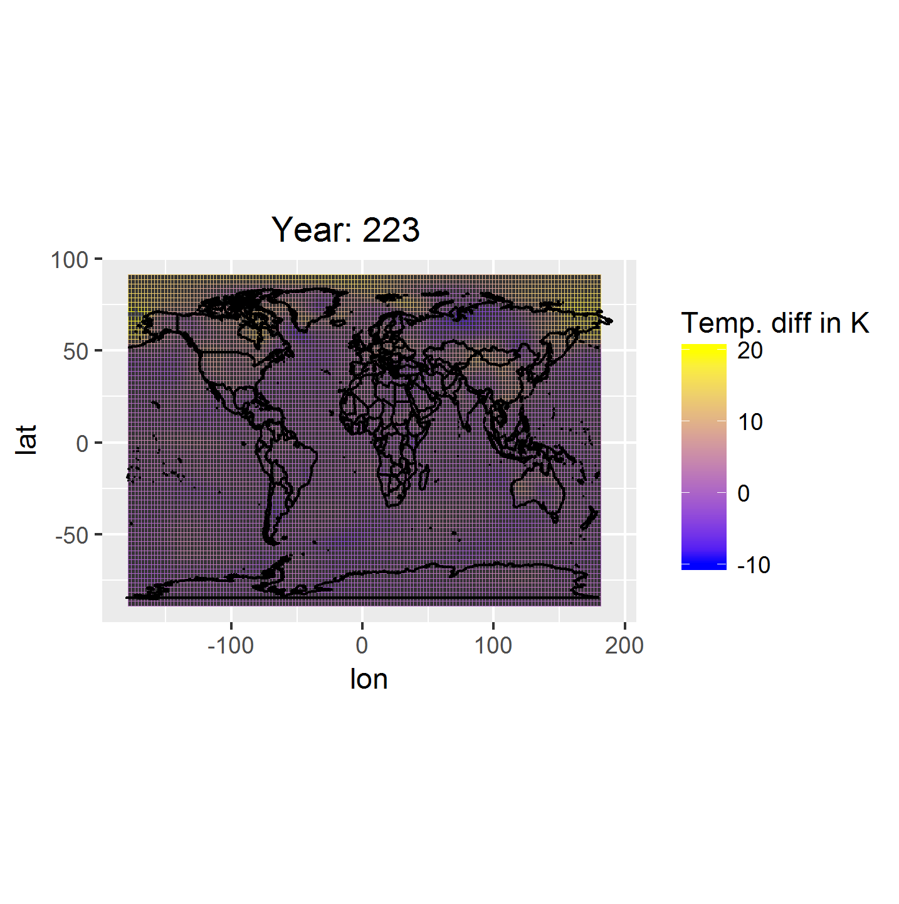

```{r, echo = FALSE}
nc_files <- list.files(paste0("/accounts/grad/yoni/Documents/Stat222/",
                              "data/cmip5-ng/"),
                       recursive = TRUE, full.names = TRUE)
nc <- nc_files[[1]]
dat <- nc_open(nc)
lat <- ncvar_get(dat, "lat")
lon <- ncvar_get(dat, "lon")
dat <- ncvar_get(dat, "tas")
```

# Introduction

Rapidly progressing, anthropogenic climate change is
not only real, but arguably the most dangerous threat facing human societies
and global stability (Union of Concerned Scientists). In order to predict spatio-temporal
changes in global climate under a variety of scenarios and assumptions, climate
researchers developed computational models to emulate long-term atmosphere and ocean
dynamics. There is hope that these models can provide policy and decision makers with
predictive tools for climate change preparedness and mitigation (see, for example,
[link](http://climateprospectus.org/)). A statistical hurdle, however, impedes this
goal: model uncertainty. Much research
has gone into understanding and limiting the sources of model uncertainty
[@Hawkins2009, @Brohan2006, @Regier2013].
Despite this progress, there remains a deeper concern
regarding model independence and its effect on uncertainty quantification.

Because the models often share both code modules as well as the
biases of their implementors, their outputs do not represent
independent draws
from a space of "all possible future climate trajectories". Thus, agreement in model
predictions does not grant greater certainty [@Larose2005]. To skirt this
issue, Knutti et al describe a method to build consensus models from combinations of
model prediction that takes into account their interdependence. By then placing a
prior over all possible consensus models, independent samples of "possible future 
climates" can be drawn and used in analyses [@Knutti2010].

There are still a number of problems with this approach. For one, it doesn't directly
address the original central problem: the models are not
independent, so model agreement doesn't imply higher certainty. Beyond the lingering
problems with prediction, we argue that there are shortcomings with the methods used
in this result. In particular, each model is originally expressed - even before EOF
(PCA) - in a severely limited form. Only 6 of the original climate variables are used
in model comparison. This appears to be due to a computational constraint (at least,
it certainly is on our machines). We would like to find a way to Incorporate more
variables into Knutti et al's
procedure. We would like to know if doing so will alter in any meaningful way
their results, and if so, what variables are most to blame for the discrepancies.

# Data Summary

We are using Coupled Model Intercomparison Project (CMIP5) data
made available by ETH Institute for Atmospheric and Climate Science, as well as
observational data gathered
(according to [@Knutti2010] Table 1). We have access to the observational dataset,
as well as data from a total of 46 models, 36 variables, under 10 different
scenarios,
combined using 47 different ensembles, available in daily/monthly/annual
aggregations, and in two spatial coordinate grids (one provided by the model source,
and another interpolated to a 2.5 by 2.5 degree grid).

To get an idea of the data in their most basic, time-series form, see Figure 1. This
plot shows time series data for surface temperature taken from the ACCESS1-3
model, under the historicalGHG scenario, resampled with r1i1p1 ensemble, and grided
to 2.5 by 2.5 degrees.

```{r, echo = FALSE, fig.cap = "Surface Temperature at (178.75,-11.25) and (11.25, -66.25)"}
tmp <- data.frame(t = seq_along(dat[72, 32,]), x1 = dat[72, 32,],
                  x2 = dat[5, 10,], lonlat = "(178.75, -11.25)",
                  LonLat = "(11.25, -66.25)")

ggplot(tmp) +
    geom_line(aes(x = t, y = x1, color = lonlat)) +
    geom_line(aes(x = t, y = x2, color = LonLat))
```

These data display the expected seasonal signature which can be seen in each
time series' auto-covariance plots (see figure 2). The degree to which this
auto-covariance holds suggest that these data are suited for compression - a
characteristic exploited by Knutti et al.

```{r, fig.cap = "Auto-covariance boxplots over the lag values for the timeseries at every lat/long pair"}
#knitr::include_graphics("/accounts/grad/yoni/Documents/Stat222/papers/boxpot.jpg")
```

In addition we can look at the entire spatial-map at an instance in time for
a single model (see figure 3):

```{r, echo = FALSE,
fig.cap = "Geo-spatial variation in air surface tempurature (K) 223 years after
simulation start"}

```

Here again we find strong auto-correlation, but this time of the spatial variety (
see figure 4).

```{r, echo = FALSE, fig.cap = "Correlogram for Geo-spatial data 231 months after simulation start"}
dat <- down_filter(dat, 4)
mat <- flatten_model(dat)
dMat <- dist(mat)
time <- 231
skel <- expand.grid(lon = 1:dim(dat)[1], lat = 1:dim(dat)[2])
skel$z <- NA
for(i in 1:dim(dat)[1]){
    for(j in 1:dim(dat)[2]){
        skel[which(skel$lon == i &
                   skel$lat == j),]$z <- dat[i,j, time]
    }
}

ncf.cor <- correlog(skel$lon, skel$lat, skel$z,
                    increment=2, resamp=100, quiet = TRUE)
```

We can also look at the euclidean distance of all the timeseries to give us
an idea of the amount of redundancy in the data (keeping in mind this is for
air temperature at surface only):

```{r, echo = FALSE, fig.cap = "Heat map of spatial similarity of TAS time series"}
heatmap(as.matrix(dMat), keep.dendro = FALSE)
```

Despite the spatial autocorrelation demostrated here, Knutti et al do not attempt to
compress the data in the spatial domain. 

# Methods

We first attempted to reproduce (roughly) the pca/mds project methods performed in
Knutti et al. which involve, in order: flattening the data for each variable;
performing a PCA on the time-dimension to reduce dimensionality; reducing each model
to a single vector by concatenating all compressed variable data; and finally
performing an MDS on the matrix of all model rows (for mathematics, see below,
excluding step A4).

We then attempted to incorporate our knowledge of spatial auto-correlation.
After flattening the data we performed two PCA's: we first performed a
PCA on the spatial dimension, selecting out the first $N$ principle components,
and then
performed a PCA on the temporal dimension, represented by the transpose of the N
principle components. We then selected $K$ of these principle components and
streched them into a single vector representing the compressed data for that model
variable. We then concatenate the vectors for all model variables involved to form
a row representing the entire model in compressed form.
With this row of data, we then proceeded with the Knutti et al methods, assembling
a model matrix and performing an MDS on the model distances.

Our algorithm 


- A) for $mod^j$ in $J models and for $var_i$ in $I variables$:
        - 1) $M_{var_i} = mod^j_{.,.,.,var_i}$
        - 2) $T = (flatten(M_{var_i}))^T$
        - 3) Let $P$ such that $T^TT = P^T\Lambda_{spatial} P$, then: $\tilde{M} = ((TP)_{.,1-N})^T$
        - 4) Let $Q$ such that $\tilde{M}^T\tilde{M} = Q^T\Lambda_{time} Q$, then: $\hat{M} = (\tilde{M}Q)_{.,1-K}$
        - 5) $R_{var_i} = [\hat{M}_{1,.}, ..., \hat{M}_{N,.}]$
      - Let $mod^j_{row} = [R_{var_1}, ..., R_{var_I}]$

- B) Let $\mathcal{M} = [(mod^1_{row})^T, ..., (mod^J_{row})^T]^T$
- C) Perform Classical MDS:
   - Let $\Delta = [d_{uv}^2]$ where $d_uv = \sqrt{||mod^u_{row} - mod^v_{row}||}$
   - Let $B = -\frac{1}{2}J\Delta J$ where $J = I - \frac{1}{J}\mathbb{1}\mathbb{1}^T$
   - Let $Q^B$ such that $B = Q^{BT}\Lambda_{dist}Q^B$, then: $\hat{\mathcal{M}} = Q^B_{.,1-2} diag{\lambda_1, \lambda_2}^{frac{1}{2}}$, where $\lambda_1$ and $\lambda_2$ are the two largest eigenvalues of $B$ and $Q^B_{.,1-2}$ are the corresponding eigenvectors.
   
We chose $N$ and $K$ by keeping the eigenvectors for each dimension that contain 90
percent of the variation.

# Results 


# Conclusions


There are multiple directions we could go. The first is to proceed with our initial
goals: improve our methods by optimizing N and M and then incorporate all model
variables as planned. Should this task prove too trivial, another more technically
challenging option exists: in a sense, the most natural way to think about these
models is not as matrices in $\mathbb{R}^{n\times n}$ but as multidimenisonal arrays
in $\mathbb{R}^{L1\times L2 \times T\times V}$ [as in citation]. We can then ask what
multidemensional array in $\mathbb{R}^{l1 \times l2 \times t\times v}$, with
$l1 < L1$, $l2 < L2$, $t < T$ and $v < V$, is closest to the original. Doing so
would compress all dimensions at the same time, capturing correlations
between and within dimensions that our flat PCA methods cannot. The caveats to
this direction are the mathematics, the implementation, and the lack of guaranteed
improvement in the results (given the effort needed for caveats one and two).
Nonetheless, it is something to keep in mind.

Alternatively, we could switch gears all together. Instead of trying to improve on
methods that sweep Independence under the rug, we could try to quantify the degree
of non-independence. So far, we have found no indications in the literature that this
has been done.

# References
